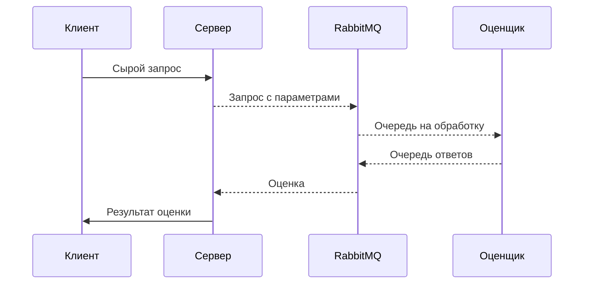

# Оценщик качества камеры 

Работа выполняется в рамках лабораторных работ по дисциплине Техническое зрение

## Архитектура

Была выбрана микросервисная архитектура с брокером. Такая архитектура позволяет максимально эффективно обрабатывать множество запросов и оценивать качество, особенно когда оно занимает значитаельное время. Ниже представлена диаграмма последовательности по взаимодействию внутри системы.

## Стек

- React
- FastAPI
- ...

## Литература

...

## Лицензия

MIT
