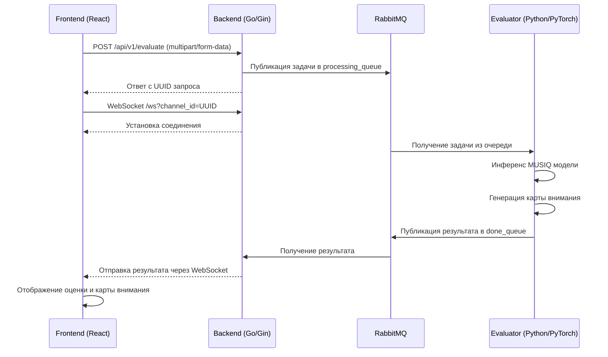

# Оценщик качества камеры 

Работа выполняется в рамках лабораторных работ по дисциплине Техническое зрение

## Описание

Сервис для автоматической оценки качества изображений с использованием нейросети MUSIQ (Multi-scale Image Quality Transformer). Система принимает изображения через веб-интерфейс, обрабатывает их с помощью модели машинного обучения и возвращает оценку качества вместе с картой внимания, показывающей наиболее важные области изображения.

## Архитектура

Проект использует микросервисную архитектуру с брокером сообщений. Такая архитектура позволяет эффективно обрабатывать множество запросов и масштабировать компоненты независимо друг от друга.


```mermaid
sequenceDiagram
    participant C as Frontend (React)
    participant B as Backend (Go/Gin)
    participant MQ as RabbitMQ
    participant E as Evaluator (Python/PyTorch)

    C->>B: POST /api/v1/evaluate (multipart/form-data)
    B->>MQ: Публикация задачи в processing_queue
    B-->>C: Ответ с UUID запроса
    
    C->>B: WebSocket /ws?channel_id=UUID
    B-->>C: Установка соединения
    
    MQ->>E: Получение задачи из очереди
    E->>E: Инференс MUSIQ модели
    E->>E: Генерация карты внимания
    E->>MQ: Публикация результата в done_queue
    
    MQ->>B: Получение результата
    B-->>C: Отправка результата через WebSocket
    C->>C: Отображение оценки и карты внимания
```

### Компоненты системы

- **Frontend** — веб-интерфейс на React для загрузки изображений и получения результатов
- **Backend** — API-сервер на Go, обрабатывающий HTTP-запросы и WebSocket-соединения
- **Evaluator** — сервис на Python для инференса модели MUSIQ и оценки качества изображений
- **RabbitMQ** — брокер сообщений для асинхронной коммуникации между backend и evaluator

## Стек технологий

### Frontend
- React 19
- TypeScript
- Vite
- Tailwind CSS
- Zustand (state management)
- Nginx (продакшн-сервер)

### Backend
- Go 1.24
- Gin (веб-фреймворк)
- Gorilla WebSocket
- RabbitMQ (amqp091-go)
- OpenAPI (генерация кода через oapi-codegen)

### Evaluator
- Python 3.10+
- PyTorch
- PyIQA (MUSIQ модель)
- FastStream (RabbitMQ consumer)
- Loguru (логирование)
- Pillow (обработка изображений)

### Инфраструктура
- Docker & Docker Compose
- RabbitMQ 4 (с management UI)

## API

### REST API

#### `POST /api/v1/evaluate`
Загрузка изображения для оценки качества.

**Request:** `multipart/form-data`
- `method_id` (integer) — ID метода оценки
- `image` (file) — файл изображения (JPEG, PNG, GIF)

**Response:** `200 OK`
```json
{
  "status": "success",
  "id": "uuid-request"
}
```

#### `GET /health`
Проверка работоспособности сервиса.

**Response:** `200 OK`

### WebSocket

#### `GET /ws?channel_id=UUID`
Установка WebSocket-соединения для получения результатов обработки в реальном времени.

**Параметры:**
- `channel_id` (UUID) — уникальный ID канала, связанный с HTTP-запросом

**Response:** `101 Switching Protocols`

## Модель оценки

Система использует **MUSIQ** (Multi-scale Image Quality Transformer) — нейросеть для оценки качества изображений без эталона (No-Reference Image Quality Assessment).

### Поддерживаемые варианты модели

- `spaq` — MUSIQ-SPAQ (обучена на SPAQ dataset)
- `koniq` — MUSIQ (обучена на KoNIQ-10k)
- `koniq-10k` — MUSIQ (альтернативное название)
- `paq2piq` — MUSIQ-PAQ2PIQ (обучена на PAQ-2-PIQ)
- `ava` — MUSIQ-AVA (обучена на AVA dataset)

### Возможности

- Оценка качества изображения (числовая оценка)
- Генерация карт внимания (attention maps), показывающих области, влияющие на оценку
- Поддержка различных форматов изображений (JPEG, PNG, WebP, BMP)
- Пакетная обработка изображений

## Быстрый старт

### Требования
- Docker & Docker Compose
- Make

### Установка и запуск

1. Инициализация проекта:
```bash
make init
```
Создаёт `.env` файл из `.env.sample` и копирует его в директорию evaluator.

2. Сборка образов:
```bash
make build
```

3. Запуск сервисов:
```bash
make up
```

4. Просмотр логов:
```bash
make logs
```

5. Остановка сервисов:
```bash
make down
```

После запуска:
- Frontend: `http://localhost:3000`
- Backend API: `http://localhost:8080`
- RabbitMQ Management UI: `http://localhost:15672` (guest/guest)

## Переменные окружения

Конфигурация хранится в файле `.env` (создаётся из `.env.sample`).

### Frontend
- `FRONTEND_EXTERNAL_PORT` — порт frontend (по умолчанию: 3000)
- `VITE_API_BASE_URL` — базовый URL API

### Backend
- `BACKEND_EXTERNAL_PORT` — порт backend (по умолчанию: 8080)
- `BACKEND_HOST` — хост backend (по умолчанию: 0.0.0.0)
- `PHOTOS_DIR` — директория для хранения фотографий
- `READ_TIMEOUT_IN_SEC`, `WRITE_TIMEOUT_IN_SEC`, `IDLE_TIMEOUT_IN_SEC`, `SHUTDOWN_TIMEOUT_IN_SEC` — таймауты сервера

### RabbitMQ
- `RABBITMQ_HOST` — хост RabbitMQ
- `RABBITMQ_PORT_UI` — порт management UI (по умолчанию: 15672)
- `RABBITMQ_PORT_AMQP` — порт AMQP (по умолчанию: 5672)
- `RABBITMQ_USER`, `RABBITMQ_PASSWORD` — учётные данные
- `RABBITMQ_PHOTO_QUEUE_NAME` — очередь задач (по умолчанию: processing_queue)
- `RABBITMQ_RESPONSE_QUEUE_NAME` — очередь результатов (по умолчанию: done_queue)
- `RABBITMQ_PUBLISH_TIMEOUT_IS_SEC` — таймаут публикации сообщений

## Структура проекта

```
camera-evaluator/
├── frontend/          # React веб-интерфейс
├── backend/           # Go API-сервер
│   ├── api/          # OpenAPI спецификации
│   ├── cmd/          # Точка входа
│   └── internal/     # Внутренние пакеты
├── evaluator/         # Python сервис оценки
│   └── src/
│       ├── model/    # MUSIQ инференс
│       └── broker/   # RabbitMQ consumer
├── docker-compose.yml
├── Makefile
└── README.md
```

## Лицензия

MIT
